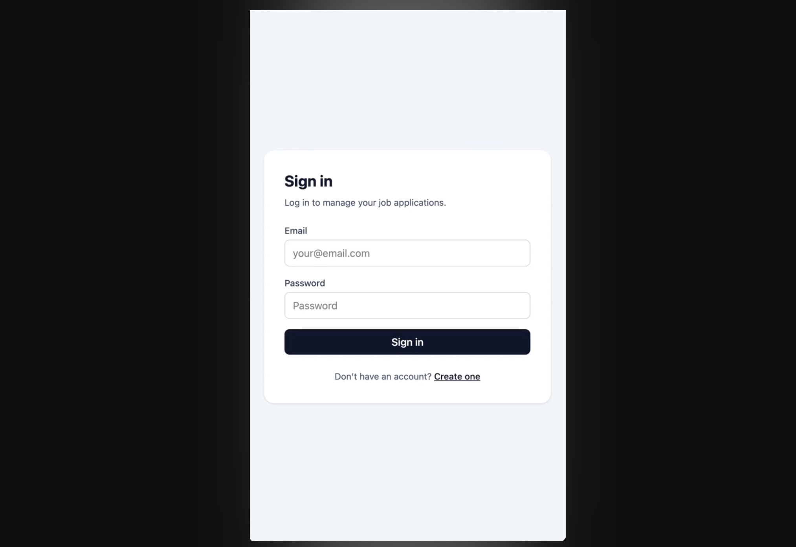
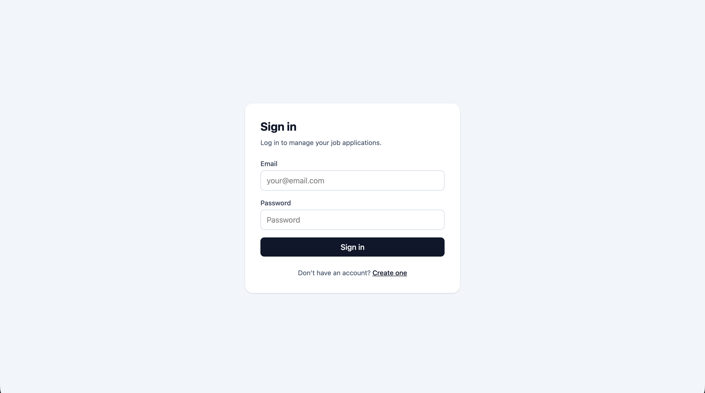

# Job Application Tracker


## Overview

Job Application Tracker is a full-stack application for managing the job search process. Users can track job applications, statuses, notes, interviews, reminders, uploaded documents, and reusable email templates.

The project includes a production-style ASP.NET Core backend, PostgreSQL database, React/TypeScript frontend, Docker Compose setup, integration tests, frontend tests, structured logging, health checks, and GitHub Actions CI.

This project was built to demonstrate real-world full-stack engineering practices, including authentication, authorization, relational database modeling, API design, frontend state management, file handling, testing, CI/CD, and containerized development.

### Mobile Demo (v.1.1.0)
Click the image to watch the demo on youtube.
[](https://youtu.be/fIlqxNWOgS4)
### Web Demo (v.1.1.0)
[](https://youtu.be/99ZB_1neGbA)


## Tech Stack

### Frontend

- React
- TypeScript
- Vite
- Tailwind CSS
- React Router
- TanStack Query
- React Hook Form
- Zod
- Axios
- Vitest
- React Testing Library

### Backend

- C#
- ASP.NET Core Web API
- Entity Framework Core
- PostgreSQL
- JWT Authentication
- Refresh Tokens
- FluentValidation
- Swagger / OpenAPI
- Serilog
- Health Checks

### Testing

- xUnit
- FluentAssertions
- WebApplicationFactory
- Testcontainers
- PostgreSQL test container
- Vitest
- React Testing Library
- Coverlet code coverage

### DevOps

- Docker
- Docker Compose
- GitHub Actions
- CI pipeline for backend and frontend build/test checks

---

## Features
### Backend Features
- JWT authentication with refresh tokens
- Register, login, refresh token, and logout flow
- User-scoped job application tracking
- Protected endpoints with authorization
- Search, filter, sort, and pagination for job applications
- Notes per application
- Status history tracking
- Interview scheduling
- Reminders for follow-ups, deadlines, interviews, and assignments
- Global upcoming reminders endpoint
- Mark reminders complete/incomplete
- File uploads and downloads for resumes, cover letters, job descriptions, and assignments
- Email templates with placeholders
- Email template preview using job application data
- Dashboard analytics
- Health checks
- Structured logging with Serilog
- Centralized exception handling middleware
- Reusable current-user service
- Integration tests with Testcontainers PostgreSQL
- GitHub Actions CI with code coverage

### Frontend Features
- React frontend with protected routes
- Login and registration UI
- Dashboard page with job search summary
- Job application list with search, filter, sort, and pagination
- Create, edit, delete, and detail pages for job applications
- Notes, interviews, reminders, documents, and email template preview UI
- Automatic access token refresh with refresh tokens
- Shared reusable UI components
- Shared job application form component
- Frontend tests with Vitest and React Testing Library
- Full-stack Docker Compose setup

---

## Architecture

The project is organized as a full-stack application with separate frontend and backend folders:

```text
job-application-tracker/
  frontend/
    src/
      api/
      components/
      features/
      pages/
      router/
      types/
      test/

  backend/
    JobTracker.Api/
    JobTracker.Application/
    JobTracker.Domain/
    JobTracker.Infrastructure/
    JobTracker.Tests/

  docker-compose.yml
```

### Project Responsibilities

#### `JobTracker.Api`

Contains the ASP.NET Core Web API layer.

Responsibilities:

* Controllers
* API request/response DTOs
* Authentication endpoints
* Middleware
* Swagger configuration
* Dependency injection setup
* JWT token service
* Current user service
* Validation
* API-specific mappers

#### `JobTracker.Domain`

Contains core domain models and enums.

Examples:

* `User`
* `JobApplication`
* `ApplicationNote`
* `ApplicationStatusHistory`
* `Interview`
* `Reminder`
* `Document`
* `EmailTemplate`

#### `JobTracker.Infrastructure`

Contains database-related infrastructure.

Responsibilities:

* `AppDbContext`
* Entity Framework Core configuration
* Database mappings
* Migrations

#### `JobTracker.Tests`

Contains integration tests.

Responsibilities:

* Auth tests
* Protected endpoint tests
* User data isolation tests
* Testcontainers PostgreSQL setup
* API behavior verification

#### `frontend`

Contains the React/TypeScript frontend.

Responsibilities:

- Authentication pages
- Protected routing
- Dashboard UI
- Job application CRUD UI
- Notes, interviews, reminders, documents, and email template UI
- API client modules
- Shared UI components
- Frontend tests

---

## Database Schema

The database is designed around user-owned job application data.

### Main Tables

```text
Users
JobApplications
ApplicationNotes
ApplicationStatusHistories
Interviews
Reminders
Documents
EmailTemplates
```

### Entity Relationships

```text
User
  ├── JobApplications
  └── EmailTemplates

JobApplication
  ├── ApplicationNotes
  ├── ApplicationStatusHistories
  ├── Interviews
  ├── Reminders
  └── Documents
```

### Users

Stores account information and refresh token data.

Important fields:

```text
Id
Email
PasswordHash
FirstName
LastName
RefreshToken
RefreshTokenExpiresAt
CreatedAt
```

### JobApplications

Stores each job application owned by a user.

Important fields:

```text
Id
UserId
CompanyName
JobTitle
Location
JobUrl
Status
DateApplied
Deadline
SalaryRange
Notes
CreatedAt
UpdatedAt
```

### ApplicationNotes

Stores notes attached to a job application.

Important fields:

```text
Id
JobApplicationId
Content
CreatedAt
```

### ApplicationStatusHistories

Stores status changes over time.

Important fields:

```text
Id
JobApplicationId
OldStatus
NewStatus
ChangedAt
```

### Interviews

Stores scheduled interviews for job applications.

Important fields:

```text
Id
JobApplicationId
Title
Type
ScheduledAt
DurationMinutes
InterviewerName
MeetingLink
Location
Notes
CreatedAt
UpdatedAt
```

### Reminders

Stores reminders for deadlines, interviews, follow-ups, and assignments.

Important fields:

```text
Id
JobApplicationId
Title
Type
RemindAt
IsCompleted
CreatedAt
UpdatedAt
```

### Documents

Stores metadata for uploaded documents.

Important fields:

```text
Id
JobApplicationId
OriginalFileName
StoredFileName
ContentType
SizeBytes
Type
UploadedAt
```

### EmailTemplates

Stores reusable email templates owned by each user.

Important fields:

```text
Id
UserId
Name
Type
Subject
Body
CreatedAt
UpdatedAt
```

---

## API Endpoints

### Authentication

| Method | Endpoint             | Description               |
| ------ | -------------------- | ------------------------- |
| `POST` | `/api/auth/register` | Register a new user       |
| `POST` | `/api/auth/login`    | Log in and receive tokens |
| `POST` | `/api/auth/refresh`  | Refresh access token      |
| `POST` | `/api/auth/logout`   | Invalidate refresh token  |

### Job Applications

| Method   | Endpoint                     | Description                    |
| -------- | ---------------------------- | ------------------------------ |
| `GET`    | `/api/job-applications`      | Get paginated job applications |
| `GET`    | `/api/job-applications/{id}` | Get one job application        |
| `POST`   | `/api/job-applications`      | Create a job application       |
| `PUT`    | `/api/job-applications/{id}` | Update a job application       |
| `DELETE` | `/api/job-applications/{id}` | Delete a job application       |

### Query Parameters for Job Applications

`GET /api/job-applications` supports:

| Parameter       | Description                                                              |
| --------------- | ------------------------------------------------------------------------ |
| `search`        | Search company, job title, or location                                   |
| `status`        | Filter by application status                                             |
| `sortBy`        | Sort by `createdAt`, `company`, `jobTitle`, `deadline`, or `dateApplied` |
| `sortDirection` | `asc` or `desc`                                                          |
| `page`          | Page number                                                              |
| `pageSize`      | Number of items per page                                                 |

Example:

```text
GET /api/job-applications?search=microsoft&status=1&sortBy=deadline&sortDirection=asc&page=1&pageSize=10
```

### Application Notes

| Method   | Endpoint                                                  | Description                  |
| -------- | --------------------------------------------------------- | ---------------------------- |
| `GET`    | `/api/job-applications/{jobApplicationId}/notes`          | Get notes for an application |
| `POST`   | `/api/job-applications/{jobApplicationId}/notes`          | Add note                     |
| `DELETE` | `/api/job-applications/{jobApplicationId}/notes/{noteId}` | Delete note                  |

### Status History

| Method | Endpoint                                    | Description               |
| ------ | ------------------------------------------- | ------------------------- |
| `GET`  | `/api/job-applications/{id}/status-history` | Get status change history |

### Interviews

| Method   | Endpoint                                                            | Description       |
| -------- | ------------------------------------------------------------------- | ----------------- |
| `GET`    | `/api/job-applications/{jobApplicationId}/interviews`               | Get interviews    |
| `GET`    | `/api/job-applications/{jobApplicationId}/interviews/{interviewId}` | Get one interview |
| `POST`   | `/api/job-applications/{jobApplicationId}/interviews`               | Create interview  |
| `PUT`    | `/api/job-applications/{jobApplicationId}/interviews/{interviewId}` | Update interview  |
| `DELETE` | `/api/job-applications/{jobApplicationId}/interviews/{interviewId}` | Delete interview  |

### Reminders

| Method   | Endpoint                                                                     | Description                                    |
| -------- | ---------------------------------------------------------------------------- | ---------------------------------------------- |
| `GET`    | `/api/job-applications/{jobApplicationId}/reminders`                         | Get reminders for an application               |
| `POST`   | `/api/job-applications/{jobApplicationId}/reminders`                         | Create reminder                                |
| `PUT`    | `/api/job-applications/{jobApplicationId}/reminders/{reminderId}`            | Update reminder                                |
| `DELETE` | `/api/job-applications/{jobApplicationId}/reminders/{reminderId}`            | Delete reminder                                |
| `PATCH`  | `/api/job-applications/{jobApplicationId}/reminders/{reminderId}/complete`   | Mark reminder complete                         |
| `PATCH`  | `/api/job-applications/{jobApplicationId}/reminders/{reminderId}/incomplete` | Mark reminder incomplete                       |
| `GET`    | `/api/reminders/upcoming`                                                    | Get upcoming reminders across all applications |

### Documents

| Method   | Endpoint                                                                   | Description            |
| -------- | -------------------------------------------------------------------------- | ---------------------- |
| `GET`    | `/api/job-applications/{jobApplicationId}/documents`                       | Get uploaded documents |
| `POST`   | `/api/job-applications/{jobApplicationId}/documents`                       | Upload document        |
| `GET`    | `/api/job-applications/{jobApplicationId}/documents/{documentId}/download` | Download document      |
| `DELETE` | `/api/job-applications/{jobApplicationId}/documents/{documentId}`          | Delete document        |

Supported file types:

```text
PDF
DOC
DOCX
TXT
```

### Email Templates

| Method   | Endpoint                                                       | Description                    |
| -------- | -------------------------------------------------------------- | ------------------------------ |
| `GET`    | `/api/email-templates`                                         | Get user email templates       |
| `GET`    | `/api/email-templates/{id}`                                    | Get one template               |
| `POST`   | `/api/email-templates`                                         | Create template                |
| `PUT`    | `/api/email-templates/{id}`                                    | Update template                |
| `DELETE` | `/api/email-templates/{id}`                                    | Delete template                |
| `GET`    | `/api/email-templates/{templateId}/preview/{jobApplicationId}` | Preview template with job data |

Supported placeholders:

```text
{{CompanyName}}
{{JobTitle}}
{{Location}}
{{DateApplied}}
{{Deadline}}
```

### Dashboard

| Method | Endpoint               | Description             |
| ------ | ---------------------- | ----------------------- |
| `GET`  | `/api/dashboard/stats` | Get dashboard analytics |

Dashboard stats include:

```text
Total applications
Applications by status
Upcoming deadlines
Recent applications
Offer count
Rejection count
Interviewing count
```

### Health Check

| Method | Endpoint  | Description               |
| ------ | --------- | ------------------------- |
| `GET`  | `/health` | Check API/database health |

---

## Authentication Flow

The API uses JWT access tokens and refresh tokens.

### Register

```text
POST /api/auth/register
```

Request:

```json
{
  "email": "test@example.com",
  "password": "Password123!",
  "firstName": "Test",
  "lastName": "User"
}
```

Response:

```json
{
  "accessToken": "jwt-access-token",
  "refreshToken": "refresh-token",
  "email": "test@example.com",
  "userId": "user-guid"
}
```

### Login

```text
POST /api/auth/login
```

Request:

```json
{
  "email": "test@example.com",
  "password": "Password123!"
}
```

Response:

```json
{
  "accessToken": "jwt-access-token",
  "refreshToken": "refresh-token",
  "email": "test@example.com",
  "userId": "user-guid"
}
```

### Refresh Token

```text
POST /api/auth/refresh
```

Request:

```json
{
  "refreshToken": "refresh-token"
}
```

Response:

```json
{
  "accessToken": "new-jwt-access-token",
  "refreshToken": "new-refresh-token",
  "email": "test@example.com",
  "userId": "user-guid"
}
```

### Logout

```text
POST /api/auth/logout
```

Request:

```json
{
  "refreshToken": "refresh-token"
}
```

Response:

```text
204 No Content
```

### Protected Endpoints

Protected endpoints require the access token in the Authorization header:

```text
Authorization: Bearer <accessToken>
```

---

## Setup Instructions

### Prerequisites

Install:

```text
.NET SDK
Docker Desktop
Git
```

Optional:

```text
Postman
pgAdmin
Visual Studio
VS Code
```

### Clone Repository

```bash
git clone https://github.com/Inez-y/job-application-tracker.git
cd job-application-tracker
```

### Start PostgreSQL for Local Development

```bash
docker compose up -d postgres
```

### Restore Packages

```bash
cd backend
dotnet restore
```

### Apply Database Migrations

```bash
dotnet ef database update \
  --project JobTracker.Infrastructure \
  --startup-project JobTracker.Api
```

### Run API

```bash
dotnet run --project JobTracker.Api
```

### Open Swagger

After the API starts, open the Swagger URL shown in the terminal.

Example:

```text
http://localhost:YOUR_PORT/swagger
```

For the frontend, see the Frontend Setup section below.

---

## Environment Configuration

### Frontend

Create `frontend/.env`:

```env
VITE_API_BASE_URL=http://localhost:5187
```

For Docker Compose, the frontend is built with:

```env
VITE_API_BASE_URL=http://localhost:8080
```

### Backend

Local backend settings can be configured with `appsettings.Development.json` or environment variables.

Required backend values:

```text
ConnectionStrings__DefaultConnection
Jwt__Key
Jwt__Issuer
Jwt__Audience
```

Example connection string:

```text
Host=localhost;Port=5433;Database=jobtracker;Username=jobtracker_user;Password=jobtracker_password
```

---
## Frontend Setup

From the project root:

```bash
cd frontend
npm install
```

Create a local environment file:

```bash
cp .env.example .env
```

Example:

```env
VITE_API_BASE_URL=http://localhost:5187
```

Run the frontend:

```bash
npm run dev
```

The frontend will usually run at:

```text
http://localhost:5173
```

---
## Running with Docker Compose

This project can run the full stack with Docker Compose:

- PostgreSQL database
- ASP.NET Core API
- React frontend served with Nginx

### Start the full stack

From the project root:

```bash
docker compose up --build
```

### App URLs

| Service | URL |
|---|---|
| Frontend | `http://localhost:3000` |
| API Swagger | `http://localhost:8080/swagger` |
| API Health Check | `http://localhost:8080/health` |
| PostgreSQL | `localhost:5433` |

### Database migrations

The API automatically applies Entity Framework Core migrations on startup in the local Docker development environment.

You should see logs like:

```text
Applying database migrations...
Database migrations applied successfully.
```

### Stop containers

```bash
docker compose down
```

### Reset database volume

```bash
docker compose down -v
```

## Running Tests

### Backend Tests

From the `backend` folder:

```bash
dotnet test
```

The backend test suite uses:

```text
xUnit
FluentAssertions
WebApplicationFactory
Testcontainers
PostgreSQL
```

Testcontainers automatically starts a temporary PostgreSQL container during integration tests.

### Frontend Tests

From the `frontend` folder:

```bash
npm run test:run
```

The frontend test suite uses:

```text
Vitest
React Testing Library
JSDOM
Testing Library Jest DOM
```

### Backend Test Coverage

From the `backend` folder:

```bash
dotnet test JobTracker.sln --collect:"XPlat Code Coverage"
```

Coverage files are generated under:

```text
JobTracker.Tests/TestResults/
```

## CI/CD

GitHub Actions runs CI automatically for backend and frontend changes.

The workflow performs:

```text
Restore backend dependencies
Build backend
Run backend tests
Collect backend code coverage
Install frontend dependencies
Build frontend
Run frontend tests
Upload coverage artifacts
```

Workflow file:

```text
.github/workflows/backend-ci.yml
```

---

## Validation

The API uses FluentValidation for request validation.

Examples of validation rules:

```text
Email must be valid
Password must meet minimum length
Company name is required
Job title is required
Job URL must be valid
Notes cannot exceed max length
Deadline cannot be in the past
```

Invalid requests return:

```text
400 Bad Request
```

---

## Error Handling

The API includes centralized exception handling middleware.

Unexpected errors return a consistent JSON response:

```json
{
  "statusCode": 500,
  "message": "An unexpected error occurred."
}
```

Unauthorized access returns:

```json
{
  "statusCode": 401,
  "message": "Unauthorized."
}
```

---

## Logging

The API uses Serilog for structured logging.

Logs are written to:

```text
Console
logs/jobtracker-.log
```

Log files are excluded from Git.

The API logs:

```text
HTTP requests
Unhandled exceptions
Authentication events
Important backend operations
```

Sensitive information such as passwords and tokens should never be logged.

---

## Security Considerations

Implemented security features:

```text
Password hashing
JWT authentication
Refresh token invalidation
Protected API endpoints
User-scoped resource access
Ownership checks before read/update/delete
File type restrictions for uploads
No direct exposure of stored file names in API responses
```

Important ownership rule:

```text
Users can only access their own job applications and related resources.
```

If a user attempts to access another user’s resource, the API returns:

```text
404 Not Found
```

This avoids revealing whether another user’s resource exists.

---

## Example Usage Flow

```text
1. Register a new account
2. Login and receive access/refresh tokens
3. Authorize Swagger with the access token
4. Create a job application
5. Add notes
6. Update application status
7. View status history
8. Schedule an interview
9. Create a reminder
10. Upload related documents
11. Create an email template
12. Preview the email template using application data
13. View dashboard stats
```

---

## Project Status

Current status:

```text
Backend API: Functional
Frontend: Functional
Authentication: Complete
Job application CRUD: Complete
Notes: Complete
Status history: Complete
Interviews: Complete
Reminders: Complete
Documents: Complete
Email templates: Complete
Dashboard stats: Complete
Backend tests: Added
Frontend tests: Added
CI: Added
Docker Compose: Added
Deployment: In progress / planned
```

---
## Future Improvements

Planned improvements:

```text
Deploy backend and frontend
Add production environment configuration
Add refresh token rotation hardening
Add rate limiting
Add email sending for reminders and templates
Add background jobs with Hangfire or Quartz.NET
Add Azure Blob Storage or AWS S3 for documents
Add role-based authorization
Add audit logging
Add OpenAPI examples
Add seed/demo data
Add calendar view for interviews and reminders
Add Google Calendar integration
Add email provider integration
Add full text search
Add soft delete support for job applications
Add admin/demo user mode
```